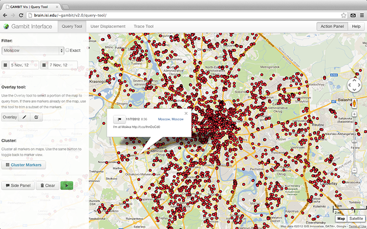
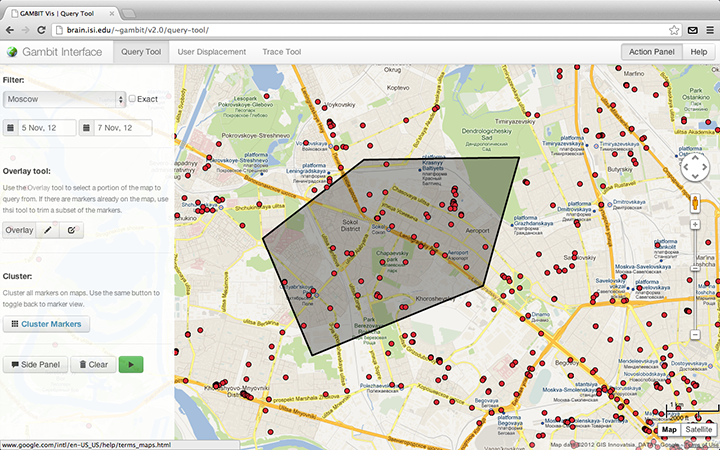
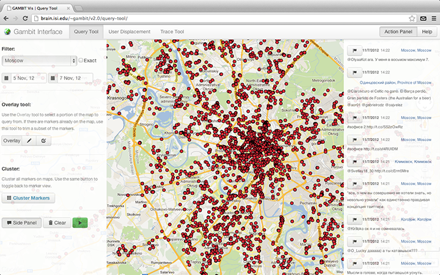
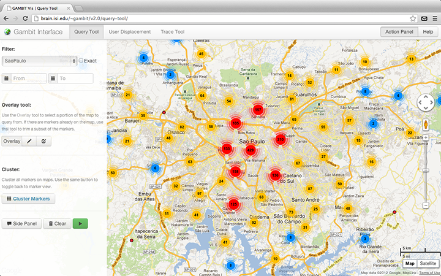
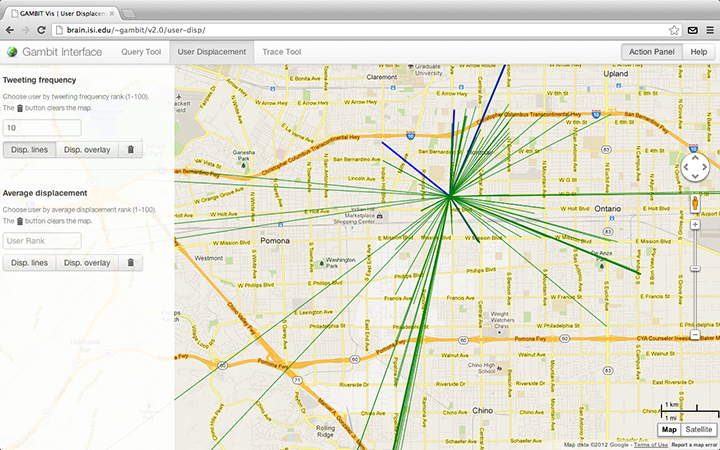
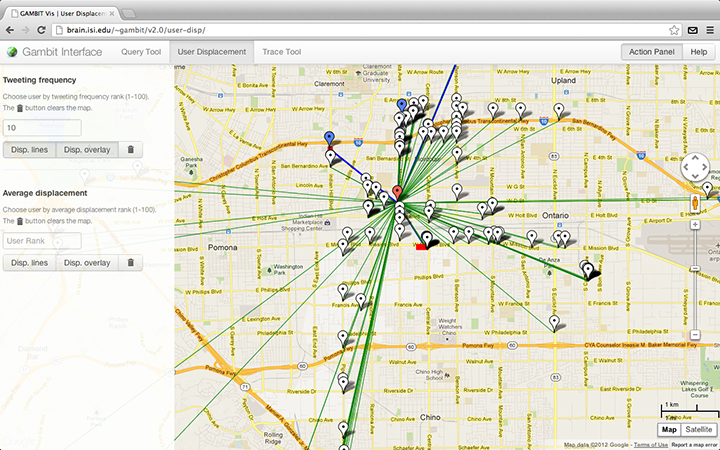
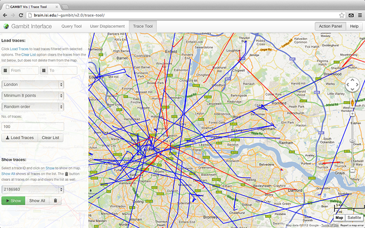

# Gambit Visualizer (*Twitter*)
[Nibir Bora](http://nibir.me) (<nbora@usc.edu>) | 
[Vladimir Zaytsev](http://zvm.me) (<zaytsev@usc.edu>)

[Computational Behavior Group](http://cbg.isi.edu), ISI, 4676 Admiralty Way, Marina del Rey, CA 90292.

---

## Query Tool

The **query tool** is an interface to all the geotagged tweets collected during the course of the project (September 29, 2012 to today). This tool can be used to visualize tweets on the map using various filters, and also perform clustering on them to identify areas of high tweeting. The results of the query are plotted as clickable `red dots` (markers) on the map. On clicking them, it reveals a dialog-box showing the tweet time and text.

Each location in the `location` drop-down menu under the *filter* section defines a bounding box for a city, or any custom locations. Location names starting with `HBK_` define gang territories within the Hollenbeck area in Los Angeles.

The following are the querry filters that can be used to view the data:

**Filter**

- `location` - specify the location to view tweets from.
- `exact` - view only those tweets that are strictly within the location's bounding box.
- `from date` / `to date` - specify date bounds to view tweets from.

**Overlay**

- `polygon` / `pencil` - draw an exact bounding polygon on the map to view tweets from.
- `rectangle` / `box` - draw an exact bounding rectangle on the map to view tweets from.

Note that the `exact`, `from date`, `to date` and *overlay* filters are optional and my be skipped. After the filters had been set, press the green `play button` to load tweets on the map.

**Trim tool**

Once there are markers on the map, the *overlay* drawing tools can be used to select the portion of markers (red dots) on map and remove the remaining. Simply click on the `polygon` / `pencil` or the `rectangle` / `box` button to draw an overlay and click on the green `play button` again.

**Side panel**

The tweet content (tweet time and text) of all marsers on the map can be viewed on the side panel by clicking on the `Side Panel` button. On using the *trim* feature, the corresponding changes are made to the sidepanel content too.

**Marker Clustering**

Marker clustering switches to a clustered representation of the markers on map. These clusters are represented by a circular graphic of varying size, corresponding the the number of markers in that cluster. The center of each graphic shows a number denoting the number of markers in that cluster.

To switch to clustered view, simply click on the `Cluster Markers` button. Use the same button to switch back to the marker view. The Marker clustering tool works in sync with the trim tool, i.e. the trim tool can be used on the clustered view as well.

The `flag` / `trace` button on the tweet dialog box or the side panel draws a trace of the perticular user using only the tweets already on map.

The `Clear` button clears all markers and overlays on map, and also clears the side panel.

## User Displacement

The **user displacement** tool is used to visualize the user movemement patterns of the 100 most tweeting users and 100 highly mobile users in Los Angeles during the month of October, 2012. This tool has 2 sections- *tweeting requency* and *average displacement*. Only one of them can be used at a time.

Type in a rank in the `User rank` field and click on `Disp. lines` and/or `Disp. overlay` button. The `Disp. lines` button shows line from the user's home location to the places s/he had visited. The *blue* lines denote frequently visited places, whereas the green lines show places visited once.

The `Disp. overlay` button places markers on the map instead of lines. The *red* marker is the user's home location. The *blue* markers show frequently visited location; clicking on a blue markers shows the number of times that location was visited.

Both the `Disp. lines` and the `Disp. overlay` buttons are toggle button, so they can be used simultaneously or in isolation. The `Clear` / `thrash` button clears markers and lines from the map.

## Trace Tool

The **trace tool** is used to visualize user traces on a certain day. A trace is defined as a sequence of geotags corresponding to a single person's movement pattern on a day. Traces are shown as blue and red lines on  the map. The blue portion of the line correspond to day time tweeting and the red during night. Our database contains traces for the month of October 2012, for the cities Los Angeles, New York and London, and for the month of November 2012, for the cities Los Angeles, New York and Chicago.

The following are the query filters that can be used to view the traces:

- `from date` / `to date` - specify date bounds to view tweets from.
- `location` - specify the location to view tweets from.
- `minimum points` - minimum number of points in a trace.
- `order` - order of the traces to be viewed.
- `number of traces` - number of traces to load

Note that the `from date` and `to date` filters are optional and my be skipped.  Click on the `Load Traces` button after setting the filter options. this loads the traces, and fills some trace ids into the dropdown menu in the `Show trace` section. The `Clear List` button clears the same dropdown menu.

To view a trace on map, select in from the dropdown menu and click on the `Show` button. Click `Show All` to show all traces in the dropdown menu. The `Clear` / `thrash` button deletes all traces on the map and also clears the dropdown menu.

The *Load traces* section can be used multiple time without clearing traces from the map.

---